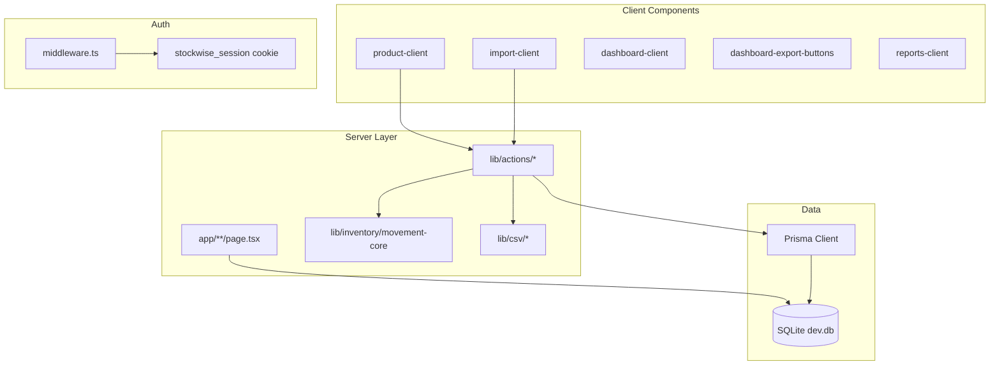

# StockWise — Living Project Documentation

> **Documentation rule:** This file is a required part of the application and must stay synchronized with the codebase. No feature work is complete until this document is updated. When code and documentation disagree, update the documentation.

---

## Project Overview

**StockWise** is a production-ready inventory management system for tracking products, stock movements, suppliers, categories, analytics, and bulk CSV imports. Built on **Next.js 16 App Router**, **TypeScript**, **Prisma**, and **SQLite**.

**Core principles:**

- `Product.quantity` is the source of truth for operational stock levels.
- Every intentional stock change should create a `StockMovement` record (via `createMovement`, CSV import, or `deleteProduct` clearing).
- Products are soft-deleted via `isArchived` — never hard-deleted from operational views.
- Server Actions + Zod validation — no parallel REST inventory API.

---

## Features

| Feature | Status | Route / Entry |
|---------|--------|---------------|
| Dashboard KPIs + movement ledger | ✅ | `/` |
| Dashboard CSV export (inventory / movements / all) | ✅ | `/` (export buttons) |
| Product CRUD + stock adjustments | ✅ | `/products` |
| Category management | ✅ | `/categories` |
| Supplier management | ✅ | `/suppliers` |
| Out-of-stock alerts + quick restock | ✅ | `/alerts` |
| Analytics + charts | ✅ | `/reports` |
| CSV export (reports) | ✅ | `/reports` (client button) |
| CSV stock movement import | ✅ | `/import` |
| Authentication (register/login/logout) | ✅ | `/auth` |
| Soft-delete products | ✅ | Products page |
| Duplicate import file protection | ✅ | SHA-256 checksum on `ImportBatch` |
| Import audit logging | ✅ | `ImportLog` per row |

---

## Tech Stack

| Layer | Technology | Version (package.json) |
|-------|------------|------------------------|
| Framework | Next.js (App Router) | 16.2.6 |
| Language | TypeScript | ^5 |
| UI | React | 19.2.4 |
| Styling | Tailwind CSS | ^4 |
| ORM | Prisma | ^7.8.0 |
| Database | SQLite (`dev.db`) via `@prisma/adapter-better-sqlite3` | — |
| Validation | Zod | ^4.4.3 |
| Forms | react-hook-form | ^7.76.0 |
| CSV parsing | PapaParse | ^5.5.3 |
| Auth hashing | bcryptjs | ^3.0.3 |
| Toasts | Sonner | ^2.0.7 |
| Charts | Recharts | ^3.8.1 |
| Icons | Lucide React | ^1.16.0 |
| Testing | Vitest | ^4.1.7 |
| UI Components | shadcn/ui (Input, Label, Select, Textarea, Dialog, Table, Badge, Alert, Tabs, Button) | latest |

---

## Architecture



**Patterns:**

- **Server Components** fetch data; **Client Components** handle forms, modals, charts, and toasts.
- **Server Actions** (`"use server"`) return `{ success: boolean; error?: string }` (import uses extended result types).
- **Atomic stock updates** via `db.$transaction` + `applyStockMovement()`.
- **Cache invalidation** via `revalidatePath()` after mutations.

---

## Folder Structure

```
inventory/
├── app/
│   ├── layout.tsx                 # Root layout, alertCount, AppShell
│   ├── page.tsx                   # Dashboard
│   ├── globals.css
│   ├── import/page.tsx            # CSV import page
│   ├── products/page.tsx
│   ├── categories/page.tsx
│   ├── suppliers/page.tsx
│   ├── alerts/page.tsx
│   ├── reports/page.tsx
│   ├── auth/
│   │   ├── layout.tsx
│   │   └── page.tsx
│   ├── api/auth/check/route.ts    # GET session status
│   └── generated/prisma/          # Generated Prisma client (do not edit)
├── components/
│   ├── layout/                    # app-shell, sidebar, mobile-header
│   ├── dashboard/
│   │   ├── dashboard-client.tsx
│   │   └── dashboard-export-buttons.tsx
│   ├── products/
│   ├── categories/
│   ├── suppliers/
│   ├── reports/
│   ├── alerts/
│   ├── import/                    # import-client, csv-dropzone, summary, errors
│   └── ui/                        # shadcn/ui components (alert, badge, button, dialog, input, label, select, table, tabs, textarea)
├── lib/
│   ├── db.ts
│   ├── utils.ts
│   ├── validators.ts
│   ├── inventory/movement-core.ts # Shared stock math (UI + import)
│   ├── csv/                       # parse, validate, normalize + tests
│   ├── utils/
│   │   ├── csv-export.ts          # buildCsvContent, downloadCsv (UTF-8 BOM)
│   │   └── export-import-template.ts
│   └── actions/
│       ├── dashboard-export-actions.ts
│       ├── auth-actions.ts
│       ├── auth-config.ts
│       ├── product-actions.ts
│       ├── movement-actions.ts
│       ├── category-actions.ts
│       ├── supplier-actions.ts
│       └── import-actions.ts
├── types/import.ts
├── types/dashboard-export.ts
├── sample-data/                   # CSV fixtures for import testing
├── hooks/use-debounce.ts
├── prisma/
│   ├── schema.prisma
│   ├── seed.ts
│   └── fix-dates.ts
├── middleware.ts
├── vitest.config.ts
├── PROJECT_DOCUMENTATION.md       # This file (living source of truth)
└── README.md                      # Quick-start summary
```

---

## Database Schema

**Provider:** SQLite (`dev.db` at project root)

### Models

| Model | Key fields | Notes |
|-------|------------|-------|
| **Product** | `sku` @unique, `quantity`, `isArchived`, `lowStockAlert`, `productType`, `price`, `costPrice` | Soft-delete via `isArchived` |
| **Category** | `name` @unique | Cascade delete → products |
| **Supplier** | `name`, `email`, `phone`, `address` | SetNull on product when supplier deleted |
| **StockMovement** | `type`, `quantity`, `note`, `date` | `type` is string (Zod-validated, not Prisma enum) |
| **User** | `username`, `email`, `password` (bcrypt) | Auth only |
| **ImportBatch** | `fileName`, `checksum` @unique, `importedBy`, `rowCount` | Duplicate file prevention |
| **ImportLog** | `batchId`, `rowNumber`, `sku`, `action`, `status`, `message` | Per-row audit trail |

### Relations

- `Product` → `Category` (required), `Supplier` (optional)
- `Product` → many `StockMovement`
- `ImportBatch` → many `ImportLog` (cascade delete)

### Design decisions

- **Soft delete:** `deleteProduct` creates a SALE movement for remaining qty, sets `quantity = 0`, `isArchived = true`.
- **Archived filtering:** Dashboard, products, alerts, layout badge use `isArchived: false`. Reports include all products.
- **Movement types in DB:** `RESTOCK`, `SALE`, `DAMAGE`, `ADJUSTMENT`, `RETURN`. CSV `PURCHASE` is normalized to `RESTOCK` on write.

---

## Authentication

### Flow

1. **Middleware** (`middleware.ts`) protects all routes except `/auth` and `/api/health`.
2. Cookie `stockwise_session` must equal `"authenticated"` (binary flag — no user ID in session).
3. **Server actions** `registerUser` / `loginUser` validate credentials against `User` table (bcrypt).
4. **`/api/auth/check`** returns `{ authenticated: boolean }` for client redirect off `/auth`.
5. Root layout reads cookie for `AppShell` login/logout state.

### Config (`lib/actions/auth-config.ts`)

| Constant | Value |
|----------|-------|
| `AUTH_COOKIE_NAME` | `stockwise_session` |
| `AUTH_REDIRECT_COOKIE` | `stockwise_redirect` (defined, unused) |

### Cookie settings

`httpOnly`, `sameSite: lax`, `maxAge: 86400`, `secure` in production.

### Limitations

- No per-user authorization or role-based access.
- Any client setting `stockwise_session=authenticated` passes middleware.
- `ImportBatch.importedBy` stores `"authenticated"` (not a user ID).

---

## Dashboard

**Route:** `/`  
**Server:** `app/page.tsx` → `getDashboardData()`  
**Client:** `components/dashboard/dashboard-client.tsx`

### Layout & Visual Enhancements

- **Dynamic Welcome Banner**: Styled with a dark radial gradient mesh, providing a time-sensitive client greeting (Good morning/afternoon/evening) and instant operational status summary. Includes responsive glassmorphic quick-action link buttons.
- **Glowing KPI Cards**: Upgraded with color-tailored inner borders, HSL-harmonious drop-shadow glows, and responsive hover scale-lifts.
- **Low Stock Pulsing Badge**: Real-time status badge inside the "Low Stock Alerts" card that pulses red and prompts action when low stock > 0, and rests on a calm green "✓ All Balanced" outline badge otherwise.
- **Interactive Analytics Grid**: Incorporates live Recharts graphs mapping ledger transaction datasets. Includes a **Stock Activity Trend** AreaChart and a **Transaction Mix** donut PieChart.
- **Collapsible Filter Control Panel**: Animates height/opacity shifts smoothly and applies high-contrast focus rings on input fields.
- **Glassmorphic Movements Ledger**: Elegant rows with hover scale transitions, custom vector empty state assets, and refined transaction action badges.

### KPIs (non-archived products only)

| KPI | Calculation |
|-----|-------------|
| Total products | `count({ isArchived: false })` |
| Inventory value | `Σ(price × quantity)` |
| Low stock count | `quantity <= lowStockAlert` |
| Supplier count | `db.supplier.count()` |

### Interactive Analytics Grid

- **Stock Activity Trend Area Chart**: Graphs chronologically sorted movements grouped by date. Shows inflows (RESTOCK, RETURN, positive ADJUSTMENT) in green and outflows (SALE, DAMAGE, negative ADJUSTMENT) in blue.
- **Transaction Mix Donut Chart**: Breakdown of movement types across the matching dataset.

### Movement ledger

- Last **50** movements, `orderBy: date desc`
- URL filters: `product`, `type`, `startDate`, `endDate`
- Display: SALE/DAMAGE prefixed with `−`; others with `+`

### Dashboard CSV export

**Client:** `components/dashboard/dashboard-export-buttons.tsx`  
**Server action:** `getDashboardExportData(filters)` in `lib/actions/dashboard-export-actions.ts`  
**Utility:** `downloadCsv()` in `lib/utils/csv-export.ts`

| Button | Output file | Contents |
|--------|-------------|----------|
| Export Inventory | `stockwise-inventory-YYYY-MM-DD.csv` | All non-archived products |
| Export Stock Movements | `stockwise-movements-YYYY-MM-DD.csv` | All movements (respects active dashboard filters) |
| Export Everything | Both files above | Two separate downloads |

**Inventory columns:** SKU, Product Name, Category, Supplier, Product Type, Quantity, Unit, Cost Price, Selling Price, Inventory Value, Created Date, Updated Date

**Movement columns:** Movement ID, SKU, Product Name, Movement Type, Quantity, Note, Date

- UTF-8 BOM enabled by default for Excel compatibility
- Requires authentication (`checkAuth()`)
- Does not duplicate stock logic — read-only export queries

---

## Products

**Route:** `/products`  
**Client:** `components/products/product-client.tsx`

- Create / edit / soft-delete products
- Stock adjustment modal → `createMovement()`
- Filters: search, type, category, supplier, stock level
- **Note:** `updateProduct()` can change `quantity` directly without a movement (audit gap if used for stock changes)

---

## Categories

**Route:** `/categories`  
**Client:** `components/categories/category-client.tsx`

- CRUD via `category-actions.ts`
- Expandable rows showing linked products
- Deleting a category cascades to its products

---

## Suppliers

**Route:** `/suppliers`  
**Client:** `components/suppliers/supplier-client.tsx`

- CRUD via `supplier-actions.ts` (requires email, phone, address)
- Deleting supplier sets `product.supplierId` to null

---

## Reports

**Route:** `/reports`  
**Server:** `app/reports/page.tsx`  
**Client:** `components/reports/reports-client.tsx`

| Output | Source |
|--------|--------|
| Category donut | Product count per category |
| Movement bar chart | Monthly sums by movement type (last 6 months) |
| Trend line | Estimated valuation trend (derived factor, not historical DB) |
| Valuation table | All products (includes archived) |
| Active products | Top 10 by movement count |

**Archived products:** Included in reports queries (no `isArchived` filter).

---

## Import System

**Route:** `/import`  
**Server page:** `app/import/page.tsx`  
**Client:** `components/import/import-client.tsx`  
**Action:** `importStockMovements(formData)` in `lib/actions/import-actions.ts`

### CSV template columns (exact order)

```
sku,productName,category,supplier,productType,unit,costPrice,price,movementType,quantity,note,date
```

### Supported CSV movement types

`PURCHASE`, `SALE`, `ADJUSTMENT`, `RETURN`, `RESTOCK`

- `PURCHASE` → persisted as `RESTOCK`
- `ADJUSTMENT` allows signed quantity (negative reduces stock)
- Other types require positive integer quantity

### Processing flow

1. Auth check (`checkAuth()`)
2. File validation (`.csv`, max 5MB, non-empty)
3. SHA-256 checksum → reject duplicate `ImportBatch`
4. Parse (PapaParse) + strict header order validation
5. Row validation (Zod `csvImportRowSchema`) — collect all errors
6. Per valid row: `db.$transaction` → resolve/create category & supplier → create product if new SKU → `applyStockMovement()` with historical `date`
7. Write `ImportLog` per row
8. `revalidatePath` on `/`, `/products`, `/reports`, `/alerts`, `/categories`, `/suppliers`, `/import`

### Product matching

| Case | Behavior |
|------|----------|
| SKU exists (active) | Apply movement only; assign supplier if product had none |
| SKU exists (archived) | Reject row |
| SKU new | Create product (`quantity: 0`), then apply movement |
| Same file, conflicting names for SKU | Validation error |

### Security

- Server-side parsing only
- Formula injection blocked (`=`, `+`, `-`, `@` at start of string fields)
- Filename sanitization

### Supporting files

| File | Role |
|------|------|
| `lib/csv/parse-csv.ts` | PapaParse + BOM strip |
| `lib/csv/validate-csv.ts` | Headers, file meta |
| `lib/csv/normalize-row.ts` | Row-level Zod |
| `lib/utils/export-import-template.ts` | Template download (UTF-8 BOM) |
| `types/import.ts` | Result/summary types |

### Tests

`lib/csv/import-validation.test.ts` — run via `npm run test` (includes sample-data file checks)

### Sample data files (`sample-data/`)

| File | Purpose |
|------|---------|
| `sample-import-valid.csv` | 20 valid rows (passes validation) |
| `sample-import-invalid.csv` | Row-level validation errors |
| `sample-import-invalid-structure.csv` | Missing `date` column (structure failure) |
| `sample-import-existing-products.csv` | Seed SKUs for update/movement tests |
| `sample-import-new-products.csv` | New SKUs, categories, suppliers |
| `README.md` | Usage notes |

---

## Export System

### Shared CSV utility

**File:** `lib/utils/csv-export.ts`

| Function | Description |
|----------|-------------|
| `buildCsvContent(data)` | Builds quoted CSV string from row objects |
| `downloadCsv(data, filename, options?)` | Browser download with UTF-8 BOM (default on) |

**Alias:** `exportToCsv()` in `lib/utils.ts` — backward-compatible wrapper for reports.

### Dashboard CSV export

See [Dashboard → Dashboard CSV export](#dashboard-csv-export).

### Reports CSV export

**Component:** `components/reports/csv-export-button.tsx`  
Uses `exportToCsv()` → `downloadCsv()` internally.

- Client-side download for valuation / activity tables on `/reports`

### Import template export

**Utility:** `lib/utils/export-import-template.ts` → `downloadImportTemplate()`

- Uses `buildCsvContent` / `downloadCsv`
- Triggered from Import page UI

---

## Server Actions

All actions return `ActionResult` unless noted: `{ success: boolean; error?: string }`

### `lib/actions/auth-actions.ts`

| Action | Description |
|--------|-------------|
| `registerUser(formData)` | Create user, set cookie, redirect `/` |
| `loginUser(formData)` | Validate password, set cookie, redirect `/` |
| `logoutUser()` | Delete cookie, redirect `/auth` |
| `checkAuth()` | Returns `boolean` |

### `lib/actions/product-actions.ts`

| Action | Description |
|--------|-------------|
| `createProduct(formData)` | Zod + create |
| `updateProduct(id, formData)` | Zod + update (includes quantity) |
| `deleteProduct(id)` | Transaction: SALE clear + archive |

### `lib/actions/movement-actions.ts`

| Action | Description |
|--------|-------------|
| `createMovement(formData)` | Transaction via `applyStockMovement()` |

**Revalidates:** `/products`, `/movements` (no page), `/`, `/reports`, `/alerts`

### `lib/actions/category-actions.ts`

| Action | Revalidates |
|--------|-------------|
| `createCategory`, `updateCategory`, `deleteCategory` | `/categories`, `/products` |

### `lib/actions/supplier-actions.ts`

| Action | Revalidates |
|--------|-------------|
| `createSupplier`, `updateSupplier`, `deleteSupplier` | `/suppliers`, `/products` |

### `lib/actions/import-actions.ts`

| Action | Returns |
|--------|---------|
| `importStockMovements(formData)` | `ImportStockMovementsResult` |
| `getImportTemplateContent()` | CSV string (server) |

### `lib/actions/dashboard-export-actions.ts`

| Action | Returns |
|--------|---------|
| `getDashboardExportData(filters?)` | `{ success, data: { inventory, movements } }` or error |

---

## Validators

**File:** `lib/validators.ts`

### Enums (application-level, not Prisma enums)

| Enum | Values |
|------|--------|
| `ProductType` | `TRADING`, `ASSET`, `CONSUMABLE` |
| `MovementType` | `RESTOCK`, `SALE`, `DAMAGE`, `ADJUSTMENT`, `RETURN` |
| `CSV_MOVEMENT_TYPES` | `PURCHASE`, `SALE`, `ADJUSTMENT`, `RETURN`, `RESTOCK` |

### Schemas

| Schema | Used by |
|--------|---------|
| `productSchema` | Product create/update |
| `categorySchema` | Category CRUD |
| `supplierSchema` | Supplier CRUD |
| `stockMovementSchema` | `createMovement` |
| `loginSchema` / `registerSchema` | Auth |
| `csvImportRowSchema` | CSV import rows |
| `hasFormulaInjection()` | CSV string safety |

---

## Utilities

| File | Functions |
|------|-----------|
| `lib/utils.ts` | `cn()`, `formatCurrency()`, `formatDate()`, `formatShortDate()`, re-exports `buildCsvContent` / `downloadCsv`, `exportToCsv()` alias |
| `lib/utils/csv-export.ts` | `buildCsvContent()`, `downloadCsv()` with UTF-8 BOM |
| `lib/db.ts` | Prisma singleton (`dev.db`, better-sqlite3 adapter) |
| `lib/inventory/movement-core.ts` | `applyStockMovement()`, `calculateNewQuantity()`, `normalizeMovementType()` |
| `lib/utils/export-import-template.ts` | `buildImportTemplateCsv()`, `downloadImportTemplate()` |
| `hooks/use-debounce.ts` | Generic debounce hook |

---

## Middleware

**File:** `middleware.ts`

| Path | Access |
|------|--------|
| `/auth`, `/api/health` | Public |
| All other matched routes | Requires `stockwise_session=authenticated` |
| Unauthenticated | Redirect to `/auth?from=<pathname>` |

**Matcher excludes:** `_next/static`, `_next/image`, `favicon.ico`, `api/health`

> Next.js 16 may deprecate `middleware` in favor of `proxy` — see build warnings.

---

## Sample Data Files

| File | Purpose |
|------|---------|
| `prisma/seed.ts` | Seeds users, categories, suppliers, products, movements |
| `prisma/fix-dates.ts` | Date helper for seed script |
| `dev.db` | SQLite database (runtime, gitignored typically) |
| `sample-data/*.csv` | Import test fixtures (see `sample-data/README.md`) |

**Seed note:** Seed creates movements independently of `Product.quantity` sync — runtime app uses quantity as source of truth updated by actions/import.

**Run seed:** `npx prisma db seed`

---

## Setup Instructions

### Prerequisites

- Node.js 20+
- npm

### Initial setup

```bash
pnpm install          # postinstall: prisma generate + better-sqlite3 native build
pnpm exec prisma db push
pnpm exec prisma db seed   # optional sample data
```

If you see `Could not locate the bindings file` for `better-sqlite3`, run:

```bash
pnpm install
# or
pnpm rebuild better-sqlite3
```

On Windows, if compile fails, install [Visual Studio Build Tools](https://visualstudio.microsoft.com/visual-cpp-build-tools/) (Desktop development with C++).

### Environment

Uses `.env` if present (Prisma config). Database file: `dev.db` at project root.

---

## Commands

| Command | Description |
|---------|-------------|
| `npm run dev` | Start development server |
| `pnpm run build` | Regenerates Prisma client, then production build |
| `postinstall` | `prisma generate` (creates `app/generated/prisma`, gitignored) |
| `npm run start` | Start production server |
| `npm run lint` | ESLint |
| `npm run test` | Vitest (CSV validation tests) |
| `npm run test:watch` | Vitest watch mode |
| `npx prisma db push` | Apply schema to SQLite |
| `npx prisma generate` | Regenerate Prisma client |
| `npx prisma db seed` | Seed database |

---

## Deployment Notes

- Set `NODE_ENV=production` for secure cookies.
- Run `npx prisma db push` (or migrations) before first deploy.
- `pnpm run build` runs `prisma generate` automatically; fresh clones also get the client from `postinstall` after `pnpm install`.
- `app/generated/prisma` is gitignored — do not commit it; regenerate locally or in CI.
- SQLite suits single-instance deploys; for multi-instance use MySQL (comment in `schema.prisma` notes provider switch).
- Build may require network access for `next/font` Google Fonts (`Inter` in `app/layout.tsx`).

---

## Known Limitations

| Area | Limitation |
|------|------------|
| Auth | Cookie flag only; no user-scoped sessions or RBAC |
| `updateProduct` | Can set quantity without movement record |
| `/movements` | Revalidated but no dedicated route (ledger on dashboard) |
| Reports trend chart | Simulated factors, not true historical snapshots |
| Alerts | Only `quantity === 0`, not `lowStockAlert` threshold |
| Import `importedBy` | Not tied to real user ID |
| Auto-created suppliers | Placeholder email/phone/address |
| Build | Pre-existing font fetch dependency on Google CDN |
| Seed vs runtime | Seed movements may not match product quantities |

---

## Future Enhancements

- User-scoped sessions and roles (admin vs viewer)
- Dedicated `/movements` page
- Route `updateProduct` quantity changes through movements only
- Low-stock alerts page (threshold-based, not only zero qty)
- True historical valuation snapshots for trend chart
- Import integration tests (checksum dedup, negative stock at DB layer)
- Batch import transaction option (all-or-nothing mode)
- MySQL / Postgres production datasource

---

## Conversation Summary (2026-05-26)

This section summarizes the major design audit and polish session conducted on 2026-05-26.

### Session Scope

Full frontend audit of **StockWise** — every page and component was reviewed for UX, accessibility, visual design, theming, and consistency. The [`impeccable`](file:///C:/Users/Anusha/.agents/skills/impeccable/SKILL.md) skill was used to guide the polish pass.

### Changes Made

| Area | Change |
|------|--------|
| **Button** (`components/ui/button.tsx`) | Added mobile touch targets (`min-h-[44px]`), responsive desktop sizing (`md:h-8 md:px-2.5`), enhanced accessibility with `focus-visible:ring-3`, added `aria-invalid` variants, `shrink-0` on SVGs |
| **Input** (`components/ui/input.tsx`) | Added mobile touch targets (`min-h-[44px]`), responsive desktop sizing (`md:h-8`), increased border radius (`rounded-md` → `rounded-lg`), enhanced focus ring (`focus-visible:ring-3`), added dark mode variants and `aria-invalid` support |
| **Sidebar** (`components/layout/sidebar.tsx`) | Added mobile touch targets to theme toggle (`min-h-[44px] min-w-[44px] md:h-8 md:w-8`), updated active link styling from gradient border to solid `bg-primary/10` |
| **Mobile Header** (`components/layout/mobile-header.tsx`) | Added mobile touch targets to menu toggle (`min-h-[44px] min-w-[44px] md:h-8 md:w-8`) |
| **Product Client** (`components/products/product-client.tsx`) | Added mobile touch targets to action buttons, replaced gradient buttons with solid `bg-primary`, added `gap-1.5` to inline action groups |
| **Category Client** (`components/categories/category-client.tsx`) | Same button/padding audit as products |
| **Supplier Client** (`components/suppliers/supplier-client.tsx`) | Same button/padding audit as products |
| **Import Client** (`components/import/import-client.tsx`) | Same button/padding audit |
| **Dark mode headings** | All page `<h1>` headings updated to use `dark:text-indigo-300` for visible contrast in dark mode |
| **Alerts page** | 17 hardcoded slate values → theme tokens, dark mode variants for icon containers |
| **globals.css** | Transition property narrowed to composited-only (`color, background-color, border-color, box-shadow, opacity, transform`) to prevent layout thrashing |
| **Focus rings** | All inputs across app unified to `focus-visible:ring-3 focus-visible:ring-ring/50` |
| **Icon-text overlap** (current) | Removed `md:px-2.5` from base Input component — responsive padding was overriding `pl-10`/`pr-10` on desktop, causing absolute-positioned prefix/suffix icons to collide with input text in auth forms and product search |

### Design System Decisions

- **No gradients**: Replaced all gradient buttons with solid `bg-primary` per design system rules
- **No backdrop blur on tables**: Flat data tables don't have decorative blur
- **No side-stripe nav borders**: Active links use `bg-primary/10` instead
- **Mobile-first touch targets**: 44px minimum on all interactive elements (<768px), compact `h-8` on desktop
- **Light-theme-locked auth**: `/auth` page enforces light theme for brand consistency

---

## Changelog

### 2026-05-26

#### Added
- **PRODUCT.md & DESIGN.md**: Created design system documentation. PRODUCT.md captures register (product), users (small business owners), brand personality (modern, clean, efficient), and design principles. DESIGN.md documents the visual system with YAML frontmatter tokens, color palette, typography, elevation, components, and do's/don'ts. Sidecar `.impeccable/design.json` written for the live panel.

#### Fixed
- **Dark mode heading contrast**: Updated `<h1>` headings on Products, Categories, Suppliers, Reports, Import, and Alerts pages to use `dark:text-indigo-300` instead of hardcoded `text-slate-900`, making them visually highlighted in dark mode. Description subtext also updated to `dark:text-indigo-400/70`.
- **Alerts page theming**: Replaced 17 hardcoded slate color values (`text-slate-900`, `text-slate-500`, `text-slate-400`, `bg-white`, `border-slate-200`, etc.) with theme tokens (`text-foreground`, `text-muted-foreground`, `bg-card`, `border-border`). Added dark mode variants for rose-themed icon containers and emerald empty-state elements. Removed `backdrop-blur-sm` from table header per design system.
- **Quick Restock button**: Replaced gradient button (`bg-gradient-to-r from-emerald-500 to-teal-600`) with solid `bg-emerald-600` in `quick-restock-button.tsx` to match design system's no-gradient rule.
- **Dashboard client polish**: Removed decorative gradient backgrounds from KPI card icon containers and bottom accent bars, replacing with solid `bg-muted` and `bg-primary/20`. Fixed hardcoded `shadow-slate-400/20` and `bg-red-50/50` with theme-aware alternatives.
- **Gradient buttons → solid primary**: Replaced all 8 `bg-gradient-to-r from-indigo-500 to-violet-600` buttons with `bg-primary text-primary-foreground` across `product-client.tsx`, `category-client.tsx`, `supplier-client.tsx`, and `sidebar.tsx` (login link). All hover states use `hover:bg-primary/80`.
- **Side-stripe nav border removed**: Replaced `bg-gradient-to-r from-indigo-500/10 via-violet-500/10 to-transparent border-l-2 border-indigo-500` on active sidebar nav links with solid `bg-primary/10`, removing the decorative gradient and side-stripe border per design system bans.
- **Touch target sizes (WCAG 2.5.5)**: Increased minimum touch target to 44px on mobile for all interactive elements. Updated `Button` default size from `h-8` to `min-h-[44px] md:h-8`, `Input` from `h-8` to `min-h-[44px] md:h-8`, `Select` trigger from `data-[size=default]:h-8` to `data-[size=default]:min-h-[44px]`. Added `min-h-[44px]` to standalone action buttons across product, category, supplier, and import clients. Increased sidebar theme toggle from `h-8 w-8` to `min-h-[44px] min-w-[44px] md:h-8 md:w-8`.
- **Mobile table column visibility**: Made SKU Code always visible on alerts page. Category and Assigned Supplier changed from `hidden lg:table-cell` to `hidden md:table-cell` (tablet+). In products page, Classification is always visible and Category visible on tablet+.
- **Hardcoded colors in export buttons and chart tooltip**: Replaced `border-slate-200 bg-white text-slate-600` with `border-border bg-card text-foreground` in `csv-export-button.tsx`. Updated `category-donut-chart.tsx` tooltip from dark-only colors (`bg-slate-800 text-white border-slate-700`) to theme-aware tokens with light/dark fallbacks. Empty state text fixed from `text-slate-400` to `text-muted-foreground`.
- **Transition performance (globals.css)**: Narrowed `button, a, input, select, textarea { transition: all 0.2s ease }` to only composited properties: `color, background-color, border-color, box-shadow, opacity, transform`. This prevents layout thrashing from animating non-visual properties (`width`, `height`, `padding`, `margin`, etc.) while preserving all existing hover/active/focus transition behavior.
- **Backdrop blur removed from table rows**: Removed `backdrop-blur-sm` from table header rows across `product-client.tsx`, `category-client.tsx`, and `reports-client.tsx` (2 instances). Flat data tables no longer have decorative blur per design system guidelines.
- **Auth focus rings aligned**: Replaced `focus:ring-2 focus:ring-indigo-500/20` (2px, 20% opacity) with `focus-visible:ring-3 focus-visible:ring-ring/50` (3px, 50% opacity, keyboard-only) on all 5 auth form inputs, matching the app-wide focus ring pattern.
- **Auth gradient buttons → solid primary**: Replaced `bg-gradient-to-r from-indigo-500 via-purple-500 to-pink-500` on login and register submit buttons with `bg-primary text-primary-foreground`, aligning with the design system's no-gradient rule.
- **Icon-text overlap in auth inputs & product search**: Removed `md:px-2.5` from the base `Input` component (`components/ui/input.tsx:12`). The responsive padding was overriding explicit `pl-10`/`pr-10` classes on desktop via CSS cascade, causing absolute-positioned prefix icons (Mail, Lock, User, Search) to collide with input text. The fix restores the intended 40px left padding for icon-bearing inputs at all breakpoints.

#### Added
- **Premium Polished Homepage/Dashboard**: Major aesthetic and functional overhaul to elevate the operator interface:
  - Added a glassmorphic Welcome Banner with radial gradients, dynamic time-aware greetings (Good Morning/Afternoon/Evening), and real-time status summary.
  - Included quick action shortcuts (Add Product, Import CSV, View Alerts) with smooth hover zoom effects.
  - Overhauled KPI cards with HSL-harmonized colors, glowing border effects, hover translation animations, and an intelligent pulsing status badge for depleted stock levels.
  - Implemented an **Interactive Analytics Section** directly on the dashboard: a cumulative AreaChart mapping chronological inflows vs outflows over time, and a sleek donut PieChart illustrating transaction mix.
  - Refined the movements ledger table with glassmorphic headers, row scale animations on hover, custom outlines on transaction action badges, and a custom SVG empty state with filter reset action.
  - Polished filter controls with smooth transition drawers and glowing ring focus states.
  - Installed and configured `dotenv` development dependency to fix prisma config builds.
- **Persisted Global Theme System (Light / Dark Modes)**:
  - Added a state-persisted global light/dark theme system controlled via dynamic Sun/Moon buttons in the sidebar footer and mobile header.
  - Caches user theme choice in `localStorage` and respects system preference (`prefers-color-scheme`) on initial load.
  - Implemented class-based theme toggles targeting the HTML element with smooth 250ms CSS variable transitions across the entire DOM tree (borders, backgrounds, colors, shadows).
  - Audited and polished client pages (`product-client.tsx`, `category-client.tsx`, `supplier-client.tsx`, `reports-client.tsx`, `dashboard-client.tsx`) to replace hardcoded colors (`bg-white`, `border-slate-200`) with theme-adaptive HSL tokens (`bg-card`, `border-border`, `text-foreground`, `bg-muted`).
- **Strict Light Theme Auth Override**:
  - Enforced a strict light theme lock on the `/auth` (login/register) route under any conditions.
  - Redesigned the auth experience with an elegant, modern, high-fidelity light gradient backdrop (`bg-gradient-to-br from-indigo-50/50 via-slate-50 to-purple-50/50`), clean card frames, slate labels, and glowing focus rings.

#### Fixed
- **Input Visibility / High-Contrast Bugs**: Audited and fixed standard `Input` (`components/ui/input.tsx`) and `Textarea` (`components/ui/textarea.tsx`) base components to explicitly declare `text-foreground`, preventing blank white-on-white/dark-on-dark typed text bugs in dark mode.
- **Inventory Chatbot UI Theme Parity**: Overhauled `components/inventory-chat.tsx` so all styling elements are fully theme-aware and responsive in light/dark modes (utilizing `bg-card`, `bg-background`, `border-border`, `text-foreground`, `bg-primary`, `text-primary-foreground`, `bg-muted`, `text-muted-foreground`), resolving low contrast issues and removing all hardcoded colors.
- **CSV Dropzone Design Alignment**: Redesigned `components/import/csv-dropzone.tsx` to utilize theme-based border and card tokens, ensuring total design parity across themes.
- **Alert Actions Contrast**: Harmonized warning tables by converting quick restock controls in `components/alerts/quick-restock-button.tsx` to theme variables.


### 2026-05-25 (g)

#### Fixed
- **`/auth` 404**: Stale Turbopack dev server on port 3000 after cache changes — restart `pnpm dev` (only one instance). Root layout no longer runs Prisma on `/auth` (avoids layout crash). `middleware.ts` renamed to `proxy.ts` per Next.js 16.

### 2026-05-25 (f)

#### Fixed
- **Auth UI regression**: shadcn/Base UI `Tabs` layout — tab list and form panels were side-by-side (narrow column). Fixed `components/ui/tabs.tsx` to use `data-[orientation=horizontal]` / `group-data-[orientation=horizontal]/tabs` per Base UI attributes.
- **Auth page shell**: `/auth` no longer renders inside dashboard `AppShell` (sidebar + narrow main column). Auth layout simplified; login card is full-screen centered again.

### 2026-05-25 (e)

#### Fixed
- **Products / suppliers / categories modals**: Base UI `FieldControl` warning when `defaultValue` changed after dialog open — forms now use `key={entity?.id ?? "new"}` to remount on create vs edit.

### 2026-05-25 (d)

#### Fixed
- **Runtime (`better-sqlite3`)**: Resolved `Could not locate the bindings file` on Windows — pnpm 10 blocks native module builds unless allowed. Added `pnpm.onlyBuiltDependencies: ["better-sqlite3"]` and `pnpm rebuild better-sqlite3` in `postinstall`.

#### Updated
- **Setup docs**: Note Windows may need [Visual Studio Build Tools](https://visualstudio.microsoft.com/visual-cpp-build-tools/) if `node-gyp` compile runs instead of `prebuild-install` binary download.

### 2026-05-25 (c)

#### Fixed
- **Build**: Resolved `Module not found: Can't resolve '@/app/generated/prisma/client'` by generating the Prisma client (`app/generated/prisma` is gitignored).

#### Updated
- **`package.json`**: `postinstall` runs `prisma generate`; `build` runs `prisma generate` before `next build` so production builds do not fail on a clean checkout.

### 2026-05-25 (b)

#### Fixed
- Fixed ESLint and TypeScript compilation errors and warnings:
  - **Auth page** (`app/auth/page.tsx`): Replaced an effect-based state reset (`activeTab` resetting `showPassword`) with a synchronous `handleTabChange` handler to avoid cascading renders (react-hooks/set-state-in-effect error).
  - **Mobile header** (`components/layout/mobile-header.tsx`): Integrated the `alertCount` prop to display an interactive, pulsing, out-of-stock badge notification dot on the Menu toggle button when `alertCount > 0` (resolves unused variable warning).
  - **Sidebar** (`components/layout/sidebar.tsx`): Cleaned up unused `Menu` import and removed unused `toggle` function destructuring.
  - **Trend chart** (`components/reports/trend-line-chart.tsx`): Swapped the explicit type `any` in Recharts `Tooltip` formatter parameter to type `unknown` to satisfy the strict `@typescript-eslint/no-explicit-any` rule.

### 2026-05-25

#### Added
- Installed and configured **shadcn/ui** components: `Input`, `Label`, `Select`, `Textarea`, `Dialog`, `Table`, `Badge`, `Alert`, `Tabs`, and `Button`.
- Added **tailwindcss-animate** for supporting shadcn/ui animations.
- Configured CSS variables in `app/globals.css` to match shadcn's theme design tokens (primary, background, border, ring, etc.).

#### Updated
- Replaced custom and raw HTML UI-layer elements with shadcn equivalents across:
  - **Products page** (`components/products/product-client.tsx`): Filter selects, product table, product type badges, stock status badges, product edit/create form dialog, and stock adjustment dialog.
  - **Dashboard** (`components/dashboard/dashboard-client.tsx`): Movement type badges, transaction/product filter selects, date inputs, labels, and movement ledger table.
  - **Categories** (`components/categories/category-client.tsx`): Category tables, sub-tables, product counts, stock alert badges, and category form dialog.
  - **Suppliers** (`components/suppliers/supplier-client.tsx`): Linked products table, product counts, and supplier form dialog.
  - **Reports** (`components/reports/reports-client.tsx`): Swapped raw tables for shadcn Tables and wrapped charts & tables under shadcn Tabs.
  - **Import errors** (`components/import/import-error-table.tsx`): Error list table.
  - **Alerts** (`app/alerts/page.tsx`): Out-of-stock products table and "All Stocked Up" empty state alert.
  - **Authentication** (`app/auth/page.tsx`): Register/login forms with shadcn inputs, labels, and tabs.

### 2026-05-21 (b)

#### Added

- Dashboard CSV export: Inventory, Stock Movements, Export Everything
- `lib/actions/dashboard-export-actions.ts` — `getDashboardExportData()`
- `lib/utils/csv-export.ts` — reusable `buildCsvContent()` / `downloadCsv()` with UTF-8 BOM
- `components/dashboard/dashboard-export-buttons.tsx`
- `types/dashboard-export.ts`
- `sample-data/` — valid, invalid, structure-invalid, existing-product, and new-product CSV fixtures
- Vitest coverage for sample-data validation files

#### Updated

- `components/dashboard/dashboard-client.tsx` — export button toolbar
- `lib/utils/export-import-template.ts` — uses shared csv-export utility
- `lib/utils.ts` — re-exports csv-export helpers

### 2026-05-21

#### Added

- CSV stock movement import system (`/import`)
- `ImportBatch` and `ImportLog` Prisma models
- Shared stock logic: `lib/inventory/movement-core.ts` (`applyStockMovement`)
- CSV utilities: `lib/csv/parse-csv.ts`, `validate-csv.ts`, `normalize-row.ts`
- Import server action: `importStockMovements()` in `lib/actions/import-actions.ts`
- Import UI: `components/import/*` (dropzone, summary, error table)
- Import template download: `lib/utils/export-import-template.ts`
- Types: `types/import.ts`
- Vitest tests for CSV validation (`lib/csv/import-validation.test.ts`)
- Sidebar navigation link to Import
- PapaParse dependency
- `PROJECT_DOCUMENTATION.md` (this living documentation file)

#### Updated

- `createMovement()` refactored to use `applyStockMovement()`
- `lib/validators.ts` — CSV schemas, `CSV_IMPORT_HEADERS`, formula injection helper
- `package.json` — `test`, `test:watch` scripts
- `prisma/schema.prisma` — import audit models

#### Fixed

- `app/page.tsx` — removed invalid `Prisma` type import from internal generated path; uses local `MovementWhereClause` type

#### Refactored

- Stock movement calculation centralized for UI and import consistency

---

## Documentation Maintenance (for contributors & AI agents)

When changing this codebase:

1. **Before:** Read this file; note impacted sections.
2. **After:** Update every affected section, folder structure, schema tables, action tables, and changelog.
3. **Validate:** New routes, models, actions, and components appear in docs; removed features are deleted from docs.

**A task is not complete until:** code compiles, tests pass (where applicable), and this file is updated with a changelog entry.
